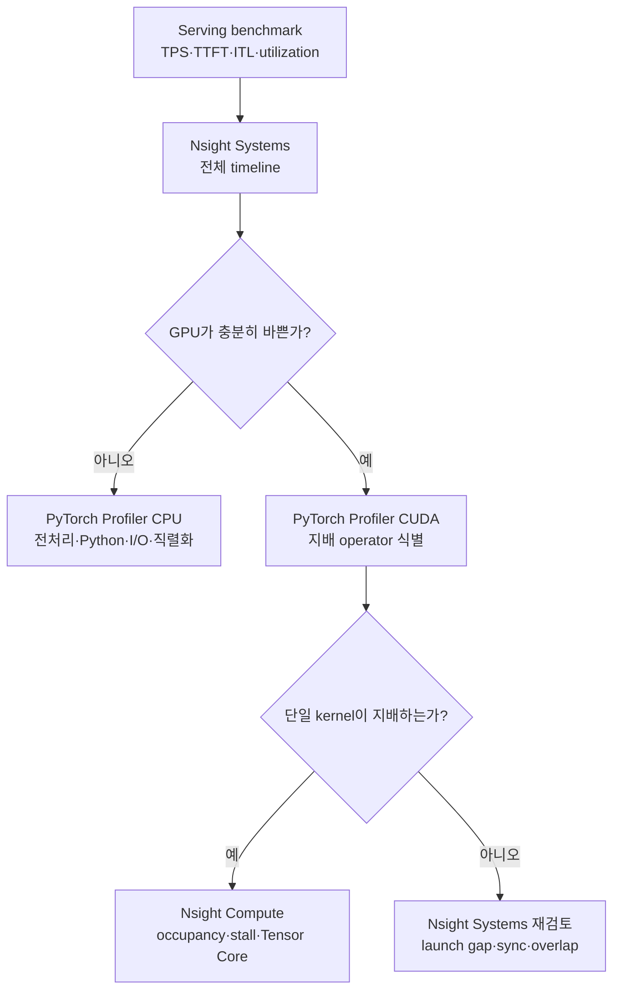
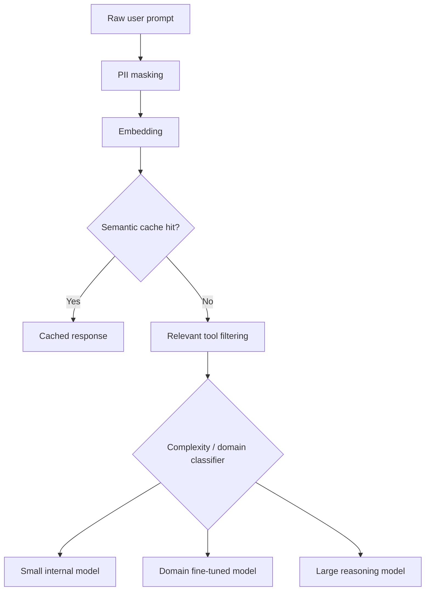
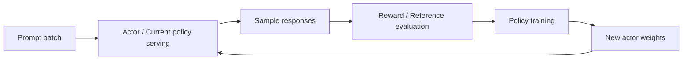

# 실전 LLM 서빙 최적화와 차세대 서빙 시스템

> 이 글의 목표는 Qwen3·vLLM 최적화 사례를 **재현 가능한 실험 절차**로 정리하고, Semantic Routing·Profiling·Multimodal·Edge·Multi-LoRA·RL Serving을 하나의 시스템 관점으로 연결하는 것이다. 핵심은 특정 옵션의 암기가 아니라 **워크로드와 SLO를 정의하고, 병목을 측정하고, 가장 적절한 계층을 바꾼 뒤 다시 검증하는 반복 과정**을 익히는 데 있다.
>
> **작성 상태:** 두 장의 핵심 개념과 원문에 기록된 실험 결과를 복습하기 쉬운 형태로 재구성했다. 수치는 CH9에 기록된 L40S·A100·RTX 4070 Ti SUPER 실험값이며, 이번 요약 작성 과정에서 벤치마크를 다시 실행하지는 않았다. 도구와 옵션은 버전에 따라 달라질 수 있으므로 실제 적용 전 현재 문서를 확인해야 한다.

## 먼저 보는 핵심 요약

1. **최적화는 설정값 찾기가 아니라 폐쇄 루프다.** 목표 정의 → 대표 트래픽 구성 → 베이스라인 측정 → 병목 가설 → 한 가지 변경 → 재측정을 반복한다.
2. **처리량을 높이는 목적은 같은 하드웨어로 더 많은 token을 처리해 cost/token을 낮추는 것이다.** 단, latency·품질·오류율·운영 복잡도가 허용 범위를 벗어나면 성공한 최적화가 아니다.
3. **워크로드가 최적화 방향을 결정한다.** 긴 입력은 Prefill, 긴 출력은 Decode, 반복 prefix는 cache, 높은 동시성은 batching과 scheduler가 중요하다.
4. **벤치마크 전에 지표와 부하 조건을 고정해야 한다.** model revision, dtype, input/output 길이, request rate, concurrency, cache 상태가 다르면 결과를 직접 비교하기 어렵다.
5. **TTFT와 ITL은 서로 다른 단계를 본다.** TTFT는 queueing·Prefill·첫 Decode의 영향을, ITL은 지속적인 Decode와 scheduling의 영향을 크게 받는다.
6. **GPU 메모리 여유는 단순한 안전 마진이 아니다.** Weight가 작아지면 KV Cache와 batch 공간이 늘어 concurrency와 처리량이 함께 증가할 수 있다.
7. **CH9의 L40S 사례에서 AWQ는 weight memory를 27.5 GiB에서 9.36 GiB로 줄였다.** KV Cache는 11.0 GiB에서 29.15 GiB로, 저장 token은 72,064개에서 191,056개로 늘었다.
8. **같은 사례의 ShareGPT 총 처리량은 474 TPS에서 1,280 TPS로 증가했다.** 평균 TTFT도 약 104 ms에서 59 ms로 줄었지만, 이는 해당 model·kernel·hardware·workload에서 얻은 결과이지 모든 양자화의 보장값은 아니다.
9. **반복 prefix는 계산 재사용 기회를 만든다.** 다만 서로 다른 데이터셋의 총 TPS만 비교해서 cache 효과를 단정하지 말고, 같은 요청 집합에서 cache on/off와 cached token 수를 비교해야 한다.
10. **추가 최적화는 병목에 맞춰 선택한다.** Prefill-heavy·공유 context에는 Prefix/KV Cache, Decode-heavy에는 Speculative Decoding, 혼합 부하에는 batching·Chunked Prefill·scheduler 조정을 먼저 검토한다.
11. **과도한 parameter tuning은 workload overfitting을 만든다.** 특정 GPU와 고정 길이 분포에서 얻은 최적값이 실제 트래픽 변화나 다른 hardware에서 실패할 수 있다.
12. **Multi-GPU가 항상 빠른 것은 아니다.** Tensor Parallelism의 collective 통신 비용이 크면 PCIe 기반 2·4 GPU가 단일 GPU보다 느릴 수 있다.
13. **수직 확장과 수평 확장의 목적이 다르다.** TP·PP는 model fit과 단일 요청 latency에, 독립 replica는 총 처리량·단순성·장애 격리에 유리하다.
14. **프로파일링은 위에서 아래로 내려간다.** Serving metric으로 증상을 찾고, PyTorch Profiler로 operator를 좁히고, Nsight Systems/Compute로 runtime과 kernel 원인을 확인한다.
15. **Semantic Cache는 token prefix가 아니라 의미가 유사한 요청의 최종 응답을 재사용한다.** hit율은 높일 수 있지만 freshness·권한·tenant 격리·오답 재사용 위험을 함께 관리해야 한다.
16. **Semantic Router는 단순 load balancer보다 위에서 동작한다.** PII masking, cache lookup, tool filtering, model·reasoning tier 선택을 하나의 요청 경로에 결합할 수 있다.
17. **멀티모달 서빙은 CPU 전처리를 새로운 병목으로 만든다.** 이미지 decode·resize·crop·tensor 변환이 GPU 실행 loop를 막지 않도록 process와 pipeline을 분리해야 한다.
18. **Edge AI의 목표 함수는 peak TPS가 아니라 latency·privacy·전력·열·비용의 균형이다.** NPU, 압축, heterogeneous compute, thermal-aware scheduling과 cloud offloading을 함께 설계한다.
19. **Multi-LoRA는 하나의 base model로 여러 저트래픽 adapter를 함께 서빙한다.** adapter별 트래픽이 충분히 크다면 merge한 독립 replica가 더 단순하고 빠를 수 있다.
20. **RLHF에서 serving은 training pipeline의 일부다.** 대량 sample 생성 처리량뿐 아니라 model update 동기화와 batch 변화에도 흔들리지 않는 재현성이 중요하다.

---

## 학습 범위

이 문서는 다음 내용을 하나의 흐름으로 통합한다.

- Qwen3-14B와 vLLM을 이용한 8단계 최적화 절차
- hardware pre-flight와 GPU memory 해석
- ShareGPT·Prefix Repetition benchmark workload 설계
- Total TPS·Output TPS·TTFT·ITL의 의미와 한계
- BF16 baseline과 AWQ 4-bit 비교
- KV Cache·batching·Chunked Prefill·Speculative Decoding 선택 기준
- Nsight Systems·Nsight Compute·PyTorch Profiler의 역할
- Tensor Parallel 기반 수직 확장과 replica 기반 수평 확장
- 처리량·latency·품질·이식성·적응성 사이의 trade-off
- Semantic Cache·Semantic Routing·LLM Gateway
- Multimodal Serving의 vision input 처리와 CPU 병목
- Edge AI의 drivers와 enablers
- Multi-LoRA의 memory·batching 구조와 적용 조건
- RLHF generation serving과 determinism
- CH9에 기록된 한국어 특화 모델 서빙 실습의 운영 교훈

## 1. 두 장을 관통하는 큰 흐름

CH9는 지금 가진 모델과 하드웨어를 어떻게 측정하고 개선할지를 다룬다. CH10은 서빙 시스템의 역할이 단일 모델 실행을 넘어 어디까지 확장되는지를 보여준다.

```text
CH9: Optimize the execution

Workload/SLO
  → Benchmark
  → Bottleneck hypothesis
  → Engine / Memory / Kernel / Scaling change
  → Verification

CH10: Optimize the decision and placement

Request meaning
  → Cache / Tool / Model routing
  → Cloud / Edge placement
  → Text / Multimodal execution
  → Tenant adapter / RL policy lifecycle
```

두 흐름은 분리되지 않는다. Semantic Router가 모델을 잘 골라도 backend가 느리면 SLO를 지키지 못하고, engine이 매우 빨라도 모든 요청을 가장 비싼 모델로 보내면 전체 비용은 높다. 따라서 실제 시스템은 다음 계층을 함께 본다.

```text
Client
  → Gateway / Policy / Semantic Router
  → Endpoint / Adapter / Placement selection
  → Serving Scheduler / KV Cache
  → Model Executor / Kernel
  → Accelerator / Interconnect / Power
```

## 2. 실전 최적화의 8단계

CH9의 최적화 계획은 다음 순서다.

| 단계 | 핵심 질문 | 남겨야 할 증거 |
| --- | --- | --- |
| 1. Hardware 점검 | 어떤 GPU이고 memory·bandwidth·interconnect는 무엇인가 | GPU model, VRAM, driver/runtime, topology, idle 상태 |
| 2. Traffic 생성 | 실제 사용 패턴을 닮았는가 | input/output 길이 분포, request rate, concurrency, prefix 반복률 |
| 3. Metric 정의 | 무엇을 개선하고 무엇을 지킬 것인가 | TPS, TTFT, ITL, error/OOM, quality와 SLO |
| 4. Server 구성 | 기본 설정에서 memory가 어떻게 배분되는가 | weight·KV memory, KV token capacity, max concurrency, startup log |
| 5. Baseline 측정 | 현재 성능은 얼마인가 | 동일 조건의 raw result와 요약표 |
| 6. Quantization | memory 절감이 cache·batch·성능으로 이어지는가 | memory·quality·latency·throughput 전후 비교 |
| 7. 추가 최적화 | 지배적 병목에 맞는 기법은 무엇인가 | 한 변수 A/B, profiler trace, regression 여부 |
| 8. Distributed 비교 | GPU 추가가 통신 비용보다 큰 이득을 주는가 | TP/PP/replica, topology, per-request latency와 aggregate TPS |

이 순서가 중요한 이유는 뒤 단계의 해석이 앞 단계의 기록에 의존하기 때문이다. 예를 들어 모델 revision과 입력 길이가 바뀐 양자화 비교는 양자화 효과만 설명하지 못한다.

## 3. 목표 함수부터 명확히 한다

CH9의 주 목표는 **단일 model instance의 token throughput 최대화**다.

```text
Cost per token
≈ Instance cost per second / Tokens processed per second
```

그러나 throughput만 최대화하면 queue가 길어져 interactive latency가 나빠질 수 있다. 실무 목표는 보통 다음과 같이 제약 조건이 붙는다.

```text
maximize   sustainable token throughput
subject to TTFT p95/p99 <= SLO
           ITL p95/p99  <= SLO
           error/OOM    <= limit
           quality      >= threshold
           cost         <= budget
```

### 처리량과 latency의 관계

- batch를 기다리면 GPU 효율과 총 처리량은 좋아질 수 있지만 queueing delay가 늘어난다.
- 요청을 즉시 작은 batch로 처리하면 latency는 낮아질 수 있지만 GPU가 충분히 차지 않는다.
- 불필요한 계산 제거, 더 좋은 kernel, cache hit와 memory traffic 감소는 두 지표를 함께 개선할 수도 있다.
- 따라서 둘이 **항상** trade-off인 것은 아니지만, 포화 지점에서는 자주 충돌한다.

## 4. Hardware pre-flight

최적화 전에 최소한 다음을 기록한다.

- accelerator model과 개수
- usable VRAM과 현재 memory usage
- compute capability 또는 accelerator architecture
- driver·CUDA/ROCm·framework version
- power state, power draw와 utilization
- PCIe, NVLink, InfiniBand/RoCE 등 topology
- MIG·virtualization·power cap 같은 resource partition
- 다른 process가 사용 중인지 여부

NVIDIA 환경에서는 `nvidia-smi`가 출발점이지만 단일 시점의 utilization만으로 병목을 결론 내리면 안 된다.

| 관찰 | 가능한 가설 | 다음 확인 |
| --- | --- | --- |
| 부하 중 GPU utilization이 낮음 | CPU 전처리, scheduler, 작은 batch, I/O | request queue, CPU profile, GPU timeline |
| power는 높은데 TPS가 낮음 | memory-bound kernel, sync, 비효율적 shape | memory bandwidth, kernel timeline, batch shape |
| VRAM이 거의 가득 참 | KV capacity·batch 제한, OOM 위험 | weight/KV/non-torch memory breakdown |
| GPU 추가 후 느려짐 | collective communication 지배 | topology와 link traffic |

## 5. 대표성 있는 Benchmark Traffic

### 5.1 왜 임의 prompt로 측정하면 안 되는가

LLM serving은 input/output 길이와 도착 패턴에 민감하다.

- 긴 input, 짧은 output: Prefill-heavy
- 짧은 input, 긴 output: Decode-heavy
- 공통 system prompt·문서가 많음: cache-friendly
- unique prompt가 대부분: cache reuse 제한
- burst traffic: queueing과 admission control 중요
- 일정한 offline batch: maximum throughput에 유리

따라서 평균 길이만 아니라 분포와 상관관계를 보존해야 한다. 긴 prompt와 긴 output이 동시에 나타나는지, tenant별 prefix가 얼마나 반복되는지도 결과에 영향을 준다.

### 5.2 CH9에서 사용한 두 데이터셋

| Dataset | 의도 | 기록된 특성 | 주의점 |
| --- | --- | --- | --- |
| ShareGPT | 실제 대화형 traffic 근사 | 100 sample에서 prompt 평균 232.6 token, output 평균 220.6 token | 서비스 domain과 언어 분포가 다를 수 있음 |
| Prefix Repetition | 공통 prefix 재사용 평가 | prefix 256 + suffix 256, prefix 10종, output 128 예시 | 실제 traffic보다 반복률이 인위적으로 높음 |

합성 workload는 특정 기능의 상한을 보기 좋지만 production 효과를 그대로 예측하지는 못한다. 자연 workload와 microbenchmark를 함께 유지해야 한다.

### 5.3 부하 발생 조건

`vllm bench serve` 같은 도구에서는 다음을 명시한다.

- `num-prompts`
- request rate와 arrival distribution/burstiness
- maximum concurrency
- input/output length와 sampling option
- streaming 여부
- warm-up과 측정 구간
- cache cold/warm 상태
- timeout, failed request 처리 방식

## 6. 평가 지표

### 6.1 네 가지 핵심 지표

| 지표 | 의미 | 주로 반영하는 것 | 함정 |
| --- | --- | --- | --- |
| Total Token Throughput | 초당 input+output token | Prefill과 Decode를 합친 시스템 작업량 | input 비율이 다른 workload끼리 직접 비교하기 어려움 |
| Output Token Throughput | 초당 생성 token | Decode 처리 능력 | 사용자별 공정성·tail latency를 숨길 수 있음 |
| TTFT | 요청부터 첫 token까지 | queueing, preprocessing, Prefill, 첫 Decode | 평균만 보면 tail을 놓침 |
| ITL | 출력 token 사이 간격 | Decode, scheduling, streaming | 구현에 따라 TPOT와 집계 방식이 다를 수 있음 |

### 6.2 평균만으로 부족한 이유

- mean: 전체 경향을 보지만 극단값에 민감하다.
- median: 전형적인 요청을 보여주지만 tail을 숨긴다.
- p95/p99: 최악에 가까운 사용자 경험과 queue collapse를 드러낸다.
- maximum: 장애성 spike를 찾는 데 유용하지만 안정적인 대표값은 아니다.

CH9 실습은 비교를 단순화하기 위해 평균 중심의 네 지표에 집중했다. Production 판단에서는 error rate, timeout, OOM, p95/p99, quality와 cost를 반드시 다시 포함해야 한다.

## 7. Baseline: Memory가 처리량을 제한하는 방식

CH9의 L40S 약 46 GB 환경에서 Qwen3-14B 기본 모델의 startup log는 다음 구조를 보였다.

| 항목 | BF16 baseline |
| --- | ---: |
| Weight memory | 27.5185 GiB |
| Available KV Cache | 11.00 GiB |
| GPU KV Cache capacity | 72,064 token |
| 40,960 token/request 기준 max concurrency | 1.76x |

인과관계는 다음과 같다.

```text
큰 weight footprint
  → KV Cache와 temporary workspace 감소
  → 동시에 유지할 sequence 감소
  → batch 형성 기회 감소 또는 eviction/recomputation 증가
  → GPU scheduling 효율 저하
  → sustainable throughput 감소
```

단, startup log의 `max concurrency`는 지정된 최대 sequence length를 기준으로 한 추정값이다. 실제 workload 길이가 짧으면 관측 동시성은 달라질 수 있다.

### ShareGPT baseline

원문에 기록된 2,000 request, request rate 10, max concurrency 10 결과다.

| 지표 | 결과 |
| --- | ---: |
| Successful requests | 2,000 |
| Output throughput | 227.64 tok/s |
| Total token throughput | 474.38 tok/s |
| Mean TTFT | 104.15 ms |
| Mean ITL | 43.24 ms |
| P99 ITL | 72.15 ms |

이 값은 이후 실험의 기준선이다. 다른 조건의 숫자를 이 표와 비교하려면 model·request set·sampling·server option이 같은지 먼저 확인해야 한다.

## 8. 반복 Prefix와 Cache 효과

동일 모델의 Prefix Repetition 기록값은 다음과 같다.

| 지표 | ShareGPT | Prefix Repetition |
| --- | ---: | ---: |
| Total token throughput | 474.38 tok/s | 1,123.13 tok/s |
| Output throughput | 227.64 tok/s | 223.31 tok/s |
| Mean TTFT | 104.15 ms | 104.64 ms |
| Mean ITL | 43.24 ms | 43.95 ms |

Total TPS는 약 2.37배지만 Output TPS와 latency는 거의 비슷하다. 이 결과는 반복 prefix의 입력 계산 재사용과 input-heavy workload의 높은 Prefill 처리량이 Total TPS에 반영된 것으로 해석할 수 있다.

### 검증 시 주의점

두 데이터셋은 token 길이와 구성 자체가 다르므로 이 비교만으로 prefix cache의 순수 효과를 분리할 수는 없다. cache 효과를 증명하려면 다음 A/B가 필요하다.

1. 같은 prompt와 같은 순서를 사용한다.
2. prefix caching만 on/off 한다.
3. cold run과 warm run을 분리한다.
4. cached token, hit rate, eviction과 recomputation을 기록한다.
5. input TPS, output TPS와 TTFT를 각각 본다.

### Cache의 세 수준

| 방식 | 재사용 대상 | match 기준 | 대표 효과 | 주요 위험 |
| --- | --- | --- | --- | --- |
| Prefix/KV Cache | 중간 KV state | 동일 token prefix | Prefill 계산 절약 | memory pressure, routing locality |
| Exact Response Cache | 최종 응답 | 동일 cache key | LLM 호출 전체 생략 | freshness, sampling·policy mismatch |
| Semantic Cache | 최종 응답 | embedding similarity | 표현이 달라도 재사용 | false hit, tenant·permission leakage |

## 9. Quantization: Weight 절감에서 Scheduling 개선까지

### 9.1 Memory 재배분

CH9의 Qwen3-14B-AWQ 4-bit 기록값이다.

| 항목 | BF16 | AWQ 4-bit | 변화 |
| --- | ---: | ---: | ---: |
| Weight memory | 27.52 GiB | 9.36 GiB | 약 66% 감소 |
| KV Cache memory | 11.00 GiB | 29.15 GiB | 약 2.65배 |
| KV token capacity | 72,064 | 191,056 | 약 2.65배 |
| Max concurrency estimate | 1.76x | 4.66x | 약 2.65배 |

```text
Weight quantization
  → weight byte 감소
  → memory bandwidth와 VRAM pressure 감소
  → 더 큰 KV Cache·batch 공간
  → 더 높은 concurrency와 scheduling 기회
  → workload가 허용하면 throughput 증가
```

### 9.2 기록된 성능 변화

ShareGPT에서 원문은 다음 결과를 기록했다.

| 지표 | BF16 | AWQ 4-bit | 변화 |
| --- | ---: | ---: | ---: |
| Total token throughput | 474 tok/s | 1,280 tok/s | 약 2.7배 |
| Mean TTFT | 약 104 ms | 59.29 ms | 약 42% 감소 |

양자화가 항상 빨라지는 것은 아니다. dequantization overhead, kernel 지원, shape, batch, accelerator 세대에 따라 4-bit kernel이 BF16/FP8보다 느릴 수 있다. 다음을 함께 확인해야 한다.

- 실제 선택된 quantization kernel과 fallback
- weight뿐 아니라 activation·KV dtype
- model quality와 domain benchmark
- load time와 artifact size
- output stability와 structured output correctness
- memory 절감이 실제 batch 증가로 이어졌는지

## 10. RTX 4070 Ti SUPER 실험에서 얻은 교훈

CH9에는 16 GB GPU에서 Qwen3-4B BF16과 AWQ를 비교한 추가 실험도 기록되어 있다. `max-model-len=8192` 조건의 요약은 다음과 같다.

| 지표 | ShareGPT BF16 | ShareGPT AWQ | Prefix BF16 | Prefix AWQ |
| --- | ---: | ---: | ---: | ---: |
| Weight memory | 7.56 GiB | 2.50 GiB | 동일 | 동일 |
| KV Cache / token | 4.74 GiB / 34,512 | 10.45 GiB / 76,064 | 동일 | 동일 |
| Max concurrency | 4.21x | 9.29x | 동일 | 동일 |
| Total TPS | 1,178 | 2,107 | 2,733 | 3,140 |
| Mean TTFT | 66.2 ms | 43.5 ms | 87.2 ms | 49.0 ms |
| Mean ITL | 16.0 ms | 7.5 ms | 17.0 ms | 7.2 ms |

이 실험은 작은 환경에서도 `weight 감소 → KV 여유 → batch/scheduling 개선` 흐름을 관찰할 수 있음을 보여준다. 동시에 AWQ에서 이미 GPU가 더 포화되어 추가 cache reuse의 상대 이득이 작아질 수 있다는 가설도 제시한다.

### Profiler에서 관찰한 것

Nsight Systems를 사용한 별도 100 prompt 측정에서는 다음이 기록되었다.

| 항목 | BF16 | AWQ |
| --- | ---: | ---: |
| 전체 처리 시간 | 46.9 s | 21.5 s |
| Total TPS | 967 | 2,105 |
| 평균 TPOT | 15.3 ms | 7.0 ms |
| 총 GPU kernel 실행 시간 | 약 7.1 s | 약 7.1 s |
| `cudaEventSynchronize` 평균 대기 | 13.92 ms | 5.67 ms |

원문은 이를 개별 kernel의 연산량 감소만이 아니라 KV 여유·batching·step turnaround와 host-GPU synchronization 개선이 중요했다는 증거로 해석한다. 이는 유용한 가설이지만, 전체 kernel 합계와 API 대기 시간만으로 인과를 완전히 분리할 수는 없다. 동일 token 수, batch shape, cache 상태와 kernel별 work를 통제한 후 재검증해야 한다.

Nsight Compute 기록에서는 다음 방향이 관찰되었다.

- BF16 GEMM과 AWQ Marlin GEMM의 achieved occupancy는 약 16.7%로 비슷했다.
- Marlin은 다양한 shape에서 하나의 계열 kernel이 더 짧고 자주 실행되었다.
- KV Cache write kernel은 두 모델에서 약 7~8 μs, occupancy 약 66%로 거의 같았다.
- Weight-only quantization이 attention의 KV representation 자체까지 자동으로 줄이는 것은 아니다.

핵심은 **kernel launch 수가 적은가**가 아니라 **요청 단위 critical path가 짧아졌는가**다.

## 11. Workload별 추가 최적화

| Workload | 우선 의심할 병목 | 먼저 검토할 기법 | 확인할 지표 |
| --- | --- | --- | --- |
| 긴 input, 공유 prefix | Prefill compute·KV capacity | Prefix Caching, LMCache, Chunked Prefill | cached token, TTFT, preemption |
| 긴 output | 반복 Decode pass | batching, Speculative Decoding, weight/KV byte 감소 | ITL, acceptance, output TPS |
| 높은 동시성 | scheduler·KV pressure | `max-num-seqs`, admission control, replica | p99 TTFT, queue, OOM |
| 혼합 길이 | head-of-line blocking | Continuous Batching, Chunked Prefill, priority | fairness, ITL variance |
| 매우 긴 context | KV capacity·transfer | quantization, offloading, P/D 분리 | KV hit/eviction, transfer time |
| 작은 batch interactive | memory-bound Decode | Speculative Decoding, low-overhead kernel | per-user ITL, accepted tokens/step |

vLLM의 대표적인 조절 범주는 다음과 같다. 실제 flag 지원 여부와 의미는 설치 버전에서 확인한다.

```text
Memory / context
  gpu-memory-utilization
  max-model-len
  block-size

Batch / scheduler
  max-num-seqs
  max-num-batched-tokens
  chunked-prefill

Reuse / execution
  prefix-caching
  speculative-decoding
  quantization backend
```

한 번에 여러 옵션을 바꾸면 어느 변경이 결과를 만들었는지 알 수 없다. 강한 기본값에서 한 변수씩 바꾸고, 효과가 작은 설정은 삭제하는 편이 유지보수에 유리하다.

## 12. 계층적 Profiling 전략

### 12.1 세 계층

| 계층 | 질문 | 대표 도구·지표 |
| --- | --- | --- |
| Serving | 사용자가 어떤 증상을 겪는가 | TPS, TTFT, ITL, queue, GPU/VRAM, errors |
| Framework | 어떤 operator와 CPU 작업이 시간을 쓰는가 | PyTorch Profiler CPU/CUDA, matmul, attention, serialization |
| Runtime/Kernel | 왜 해당 operator가 느린가 | Nsight Systems, Nsight Compute, occupancy, stalls, Tensor Core |

### 12.2 의사결정 흐름



### 12.3 도구를 고르는 기준

- **Nsight Systems:** CPU thread, CUDA API, memcpy, kernel launch와 idle gap을 시간축에서 본다.
- **PyTorch Profiler CPU:** tokenization, image preprocessing, Python dispatch, serialization 등 host 병목을 찾는다.
- **PyTorch Profiler CUDA:** GPU 시간을 attention·matmul·layernorm 같은 operator에 귀속한다.
- **Nsight Compute:** 선택한 kernel 내부의 memory stall, warp occupancy, instruction과 Tensor Core 활용을 분석한다.

모든 요청을 장시간 Nsight Compute로 수집하면 overhead가 매우 크다. 먼저 범위를 좁힌 뒤 대표 shape의 짧은 offline run으로 kernel을 분석한다.

## 13. Distributed Serving: GPU 개수보다 Topology

### 13.1 수직 확장과 수평 확장

| 관점 | 수직 확장: TP/PP | 수평 확장: independent replica |
| --- | --- | --- |
| 분할 단위 | 하나의 model execution | request traffic |
| 주목적 | model fit, 단일 요청 latency | aggregate throughput, availability |
| 통신 | layer/stage 사이 collective·activation | 일반적으로 request routing만 필요 |
| 장점 | 한 GPU보다 큰 모델, 요청당 연산 분산 | 단순 확장, failure isolation, 높은 총 TPS |
| 약점 | topology 민감, 통신·동기화 overhead | GPU마다 전체 model 필요, 단일 요청은 빨라지지 않음 |

### 13.2 CH9의 상반된 결과

- L40S 기반 g6e 환경은 GPU 간 NVLink 없이 PCIe 통신을 사용해 단일 GPU가 2·4 GPU TP보다 throughput과 TTFT 모두 좋았다.
- A100 기반 p4d 환경은 빠른 NVLink 덕분에 4 GPU 수직 확장이 1 GPU보다 낮은 latency를 기록했다.
- p4d에서 TTFT는 1 GPU 약 66 ms에서 4 GPU 약 33 ms로 줄었다.
- 그러나 총 처리량만 보면 GPU별 독립 replica 4개 합산 약 9,816 TPS가 4 GPU 단일 분산 model 약 3,926 TPS보다 거의 3배 높았다.

이 숫자들이 보여주는 원칙은 다음과 같다.

```text
목표가 model fit 또는 per-request latency
  → 빠른 interconnect를 확인하고 TP/PP 검토

목표가 aggregate throughput와 availability
  → model이 한 GPU에 들어가면 replica 우선 검토
```

GPU 세대, framework, model, batch와 traffic이 다르면 결론도 달라진다. `GPU 수 증가 = 성능 증가`를 가정하지 말고 scaling efficiency를 측정한다.

## 14. 다섯 가지 공통 Trade-off

| Trade-off | 한쪽을 택할 때 얻는 것 | 지불하는 것 |
| --- | --- | --- |
| Throughput ↔ Latency | 큰 batch와 높은 utilization | queueing과 tail latency |
| Memory efficiency ↔ Quality | 더 큰 KV·batch, 작은 artifact | accuracy·stability 검증 비용 |
| Hardware utilization ↔ Flexibility | 특정 환경의 peak 성능 | portability와 유지보수성 |
| Vertical ↔ Horizontal scaling | model fit·per-request latency 또는 aggregate TPS | communication 또는 weight 복제 |
| Static ↔ Adaptive serving | 예측 가능한 고정 동작 또는 traffic 대응력 | overfitting 또는 control complexity |

최적화는 다음 조건에서 멈춘다.

- 정의한 SLO와 quality gate를 만족한다.
- 비용 대비 추가 개선폭이 작다.
- 실제 traffic 변화에도 회귀하지 않는다.
- 운영자가 이해하고 복구할 수 있는 복잡도 안에 있다.

## 15. Semantic Cache와 Semantic Router

### 15.1 Routing 단위의 확장

기존 load balancer는 같은 모델의 replica 중 하나를 고른다. Semantic Router는 요청의 의미를 이용해 서로 다른 model endpoint, reasoning mode와 tool subset까지 고른다.



### 15.2 단계별 역할

1. **PII masking:** 이름·연락처·계정·건강 정보가 log, cache와 embedding store로 퍼지기 전에 제거한다.
2. **Embedding:** 표현이 다른 요청을 의미 공간에서 비교한다.
3. **Semantic cache:** 충분히 유사하고 재사용 가능한 응답이면 LLM 호출을 생략한다.
4. **Tool filtering:** 수많은 tool schema 중 관련 후보만 prompt에 넣는다.
5. **Model selection:** 복잡도·domain·비용·SLO에 따라 small/domain/large model과 reasoning 여부를 정한다.

### 15.3 운영 시 필요한 Guardrail

- tenant, user, locale, permission과 policy version을 cache key에 포함한다.
- 시시각각 바뀌는 정보는 TTL과 source freshness를 적용한다.
- similarity threshold만 믿지 말고 domain별 false-hit 평가셋을 만든다.
- stochastic generation parameter와 model revision을 구분한다.
- PII masking이 embedding과 cache 저장보다 먼저 실행되는지 확인한다.
- cache hit도 audit log와 quality sample에 포함한다.
- 장애 시 안전한 default model과 deterministic fallback을 둔다.

Semantic Cache는 더 많은 hit를 얻는 대신 **잘못된 응답 전체를 재사용할 위험**을 만든다. 단순 latency 기능이 아니라 correctness·security 기능으로 운영해야 한다.

## 16. LLM Gateway와 LiteLLM의 위치

CH10은 LiteLLM을 여러 provider와 local endpoint 앞에 두는 gateway/proxy 예로 소개한다.

```text
Application
  → Unified OpenAI-compatible contract
  → Auth / Virtual key / Budget / Rate limit
  → Router / Retry / Fallback / Load balancing
  → Hosted API or local vLLM endpoints
  → Async logging / Usage / Observability
```

주요 역할은 다음과 같다.

- provider별 request/response 차이를 공통 API로 흡수
- endpoint group 내부 load balancing
- timeout, retry, cooldown과 fallback
- user·team별 RPM/TPM과 budget 관리
- guardrail, PII 처리와 logging integration
- cache와 model routing
- usage·cost·latency 관찰성

Gateway의 retry는 비용과 중복 실행을 만들 수 있다. Tool call이나 외부 side effect가 있는 요청은 idempotency key와 재시도 정책을 별도로 설계한다. 또한 routing 기능과 설정 이름은 빠르게 변하므로 deprecated 예제를 그대로 복사하지 않는다.

## 17. Multimodal Serving

### 17.1 입력과 출력 모델을 구분한다

CH10의 범위는 이미지·비디오·오디오를 **입력**으로 받고 autoregressive text token을 **출력**하는 VLM이다. 이미지나 영상을 직접 생성하는 diffusion 계열은 실행 구조가 달라 별도 문제다.

### 17.2 Vision input이 들어가는 과정

```text
Image
  → Decode / Resize / Crop / Normalize
  → Patch split
  → Vision Encoder
  → Projection to LLM hidden dimension
  → Vision embeddings replace placeholder tokens

Text tokens
  → Text embeddings

[Text embeddings + Vision embeddings]
  → LLM Prefill
  → Autoregressive text Decode
```

LLM 입장에서는 text embedding과 vision embedding이 하나의 긴 sequence를 구성한다. 이미지 해상도와 patch 수는 Prefill token-equivalent length, memory와 latency에 직접 영향을 준다.

### 17.3 새로운 CPU 병목

이미지 요청은 다음 front-loaded 작업을 추가한다.

- image download와 decode
- resize, crop와 color conversion
- tensor transform와 normalization
- vision token/patch 수 계산
- 큰 tensor의 host-device transfer

요청률이 높아지면 CPU가 tensor를 준비하지 못해 GPU가 빈다. 따라서 GPU utilization이 낮다고 model kernel만 튜닝하면 문제를 해결하지 못한다.

### 17.4 Process 분리

CH10은 vLLM V0에서 V1로의 변화를 다음 구조로 설명한다.

```text
Process 0
  API + multimodal preprocessing + output postprocessing

             asynchronous handoff

Process 1
  scheduling + GPU kernel launch
```

CPU-heavy preprocessing이 GPU launch loop를 block하지 않게 decouple하는 것이 핵심이다. 실제 시스템에서는 bounded queue, backpressure, tensor lifetime과 cancellation도 함께 설계해야 한다.

## 18. Edge AI

### 18.1 세 가지 Driver: 왜 Edge인가

| Driver | 이유 | 대표 상황 |
| --- | --- | --- |
| Latency | cloud round trip조차 허용하기 어려움 | robotics, autonomous system, AR/VR |
| Data locality | raw sensitive data를 밖으로 보내지 않음 | healthcare, finance, industrial data |
| Cost | 원시 video/sensor stream 전송·저장 축소 | camera, IoT, continuous sensing |

### 18.2 다섯 가지 Enabler: 어떻게 가능한가

| Enabler | 핵심 |
| --- | --- |
| Low-power hardware | NPU와 low-precision tensor unit, TOPS/W 중심 |
| Compression/optimization | quantization·pruning·distillation·cache·kernel 최적화 |
| Heterogeneous compute | CPU·NPU·GPU에 적합한 subgraph 배치 |
| Thermal-aware scheduling | 온도에 따라 model·frame rate·core를 동적으로 조정 |
| Edge-cloud hybrid | privacy·latency가 중요한 단계는 local, 큰 model은 cloud |

Edge에서는 짧은 benchmark peak보다 sustained performance가 중요하다. 몇 분 후 thermal throttling으로 성능이 떨어지는지, battery와 memory budget을 지키는지 측정해야 한다.

### 18.3 Adaptive offloading

```text
On-device
  wake word / filtering / small model / feature extraction
       ↓ compressed feature or selected request
Cloud
  large model / expensive reasoning
```

배터리, 온도, network bandwidth, privacy policy와 deadline에 따라 실행 위치를 바꾼다. 이때 network failure 시 local fallback과 data minimization 정책이 필요하다.

## 19. Multi-LoRA Serving

### 19.1 기본 구조

LoRA는 base weight를 고정하고 작은 low-rank adapter만 학습한다. Multi-LoRA serving은 하나의 base model에 여러 adapter 요청을 섞어 처리한다.

```text
GPU
  Base model
  + Active LoRA A
  + Active LoRA B
  + Active LoRA C

CPU / Disk
  Cold adapters
```

핵심 조건은 다음과 같다.

- active adapter는 요청마다 weight 전체를 다시 load하지 않고 GPU에 준비한다.
- cold adapter는 CPU·disk에서 승격할 수 있다.
- 서로 다른 adapter 요청도 continuous batch에 함께 넣어야 utilization을 유지한다.
- Punica 계열처럼 base GEMM과 여러 adapter 연산을 효율적으로 결합하는 kernel이 필요하다.
- adapter load·eviction·version과 tenant 권한을 lifecycle로 관리한다.

### 19.2 언제 유리한가

| 상황 | 권장 방향 |
| --- | --- |
| tenant 수가 많고 adapter별 traffic이 낮음 | Multi-LoRA로 base model 공유 |
| adapter별 traffic이 이미 GPU를 포화 | base에 merge한 독립 instance와 DP 검토 |
| adapter 전환이 매우 잦음 | cache/eviction·cold load latency 우선 측정 |
| 강한 tenant isolation 필요 | memory 공유 이점보다 독립 deployment 우선 검토 |

Multi-LoRA의 목적은 모든 fine-tuned model을 하나로 합치는 것이 아니라 **낮은 개별 사용률 때문에 낭비되는 base weight 복제를 줄이는 것**이다.

## 20. Reinforcement Learning의 Serving

RLHF에서 inference engine은 production API가 아니라 training data를 만드는 generation worker가 된다.



CH10은 OpenRLHF의 추정을 인용해 training 시간의 큰 비중, 약 80%가 sample generation에 쓰일 수 있다고 설명한다. 정확한 비율은 algorithm·model·hardware에 따라 다르지만 serving throughput이 training GPU의 idle time과 전체 iteration 속도를 결정한다는 요점은 같다.

### 20.1 Production serving과 다른 요구사항

- actor weight가 반복해서 바뀌므로 replica에 빠르고 일관되게 배포해야 한다.
- rollout, reward scoring과 training 사이 backpressure를 조정해야 한다.
- 대량 sample을 만들되 policy version이 섞이지 않게 추적해야 한다.
- 동일 조건에서 재현 가능한 결과가 중요하다.

### 20.2 Determinism

batch shape, reduction order와 kernel implementation이 달라지면 floating-point 결과와 sampled token이 달라질 수 있다.

```text
작은 numerical difference
  → sampled response 변화
  → reward 변화
  → gradient estimate 변화
  → policy update drift
```

따라서 seed만 고정하는 것으로 충분하지 않을 수 있다. model/version, tokenizer, sampling implementation, batch construction과 deterministic kernel contract까지 기록해야 한다.

## 21. 한국어 특화 모델 실습에서 얻은 운영 교훈

CH9에는 16 GB GPU에서 `skt/A.X-4.0-Light`를 vLLM OpenAI-compatible server로 띄우고 Gradio UI를 연결한 기록이 있다.

```text
LAN Client
  → Gradio :7860
  → local vLLM API 127.0.0.1:8000
  → Korean language model
```

기록된 해결 사항은 다음과 같다.

- vLLM과 `transformers` 호환 문제를 version pinning으로 해결
- FastAPI middleware 호환 문제를 version pinning으로 해결
- 16 GB 환경에서 `gpu-memory-utilization`과 eager mode를 조정해 startup OOM 해결
- vLLM 직접 API와 Gradio→vLLM 전체 경로를 각각 smoke test
- API server는 loopback에 두고 UI만 LAN에 공개

이 pin은 당시 환경에 대한 해결책이지 최신 조합의 권장 버전은 아니다. 재현할 때는 다음 순서가 안전하다.

1. framework compatibility matrix와 model architecture 지원을 확인한다.
2. dependency lockfile 또는 container image digest를 기록한다.
3. `/v1/models`와 직접 completion으로 backend를 먼저 검증한다.
4. UI를 붙인 뒤 end-to-end streaming을 확인한다.
5. VRAM, error log와 장시간 stability를 확인한다.
6. 외부 공개 시 authentication, TLS와 rate limit을 추가한다.

## 22. 하나의 선택표로 연결하기

| 증상·요구사항 | 우선 볼 계층 | 후보 기법 | 성공 증거 |
| --- | --- | --- | --- |
| Cost/token이 높음 | routing + engine | small model routing, quantization, batching | quality 유지, 총비용 감소 |
| 반복 system prompt TTFT가 큼 | cache | Prefix/KV Cache, cache-aware routing | cached token 증가, TTFT p95 감소 |
| 유사 FAQ 호출이 많음 | application/gateway | Semantic Cache | false hit 제한, LLM call rate 감소 |
| GPU가 자주 idle | CPU/runtime | async preprocessing, scheduling, overlap | idle gap 감소, TPS 증가 |
| 긴 output ITL이 큼 | Decode | Speculative Decoding, kernel, batching | accepted token/step 증가, ITL 감소 |
| model이 한 GPU에 안 들어감 | distributed | quantization, TP/PP | OOM 해소, 통신 포함 SLO 충족 |
| 총 request capacity 부족 | deployment | independent replica, load balancing | aggregate TPS 증가, tail 안정 |
| 이미지 traffic에서 느림 | multimodal frontend | preprocess pool, process separation | CPU queue와 GPU idle 감소 |
| tenant별 customization이 많음 | adapter lifecycle | Multi-LoRA | GPU 수 감소, adapter SLO 유지 |
| privacy·offline requirement | placement | on-device, edge-cloud hybrid | data locality와 sustained latency 충족 |
| RL iteration이 sample을 기다림 | training serving | rollout replica, weight sync | iteration time 감소, policy version 일관성 |

## 23. 신뢰할 수 있는 실험 체크리스트

### 실험 전

- [ ] business use case와 primary SLO를 적었다.
- [ ] model ID, revision, tokenizer와 chat template을 고정했다.
- [ ] framework·driver·runtime·kernel backend version을 기록했다.
- [ ] hardware model, VRAM, topology와 power setting을 기록했다.
- [ ] 실제 traffic의 input/output/concurrency 분포를 반영했다.
- [ ] warm-up, cache cold/warm와 random seed를 정의했다.

### 실험 중

- [ ] 한 번에 한 핵심 변수만 바꾼다.
- [ ] successful request와 failure를 함께 센다.
- [ ] client/load generator가 병목이 아닌지 확인한다.
- [ ] 평균뿐 아니라 p50/p95/p99를 저장한다.
- [ ] GPU utilization, memory, power, queue와 cache metric을 같이 수집한다.
- [ ] profiling overhead가 있는 run과 benchmark run을 분리한다.

### 실험 후

- [ ] throughput 향상이 latency·quality·error 악화로 산 것인지 확인한다.
- [ ] startup, load, warm-up과 steady-state 시간을 구분한다.
- [ ] raw result와 실행 command를 보존한다.
- [ ] 다른 길이·동시성·traffic mix에서도 회귀 테스트한다.
- [ ] 결과를 관찰값, 해석, 추가 검증이 필요한 가설로 구분한다.

## 24. 추후 진행할 수 있는 실습

### 단일 GPU에서 가능한 실습

1. 동일 prompt set으로 Prefix Cache on/off A/B를 수행한다.
2. BF16·FP8·AWQ를 memory, quality, TTFT, ITL과 TPS로 비교한다.
3. concurrency를 단계적으로 올려 saturation point와 latency cliff를 찾는다.
4. Nsight Systems로 CPU gap·memcpy·kernel launch를 확인한다.
5. 대표 GEMM·attention kernel만 Nsight Compute로 좁혀 본다.
6. 한국어 모델을 OpenAI-compatible API로 서빙하고 dependency를 lock한다.
7. VLM에서 image resolution과 CPU worker 수가 TTFT에 미치는 영향을 측정한다.

### 여러 GPU·endpoint가 필요한 실습

1. `TP=2`, `PP=2`, 독립 replica 2개의 throughput·latency를 비교한다.
2. PCIe와 NVLink 환경의 collective overhead를 비교한다.
3. Semantic Router 앞에 서로 다른 크기의 vLLM endpoint를 두고 accuracy·cost를 평가한다.
4. Gateway failover 시 중복 요청과 tail latency를 측정한다.
5. 여러 LoRA adapter traffic mix에서 adapter 수·batch 효율·cold load를 측정한다.
6. RL rollout worker의 weight update 중 policy version 일관성을 확인한다.

## 25. 스스로 답해볼 핵심 질문

1. Total TPS와 Output TPS가 서로 다른 결론을 줄 수 있는 이유는 무엇인가?
2. Weight quantization이 KV Cache capacity와 concurrency를 늘리는 과정을 설명할 수 있는가?
3. 서로 다른 데이터셋의 TPS 비교만으로 Prefix Cache 효과를 증명할 수 없는 이유는 무엇인가?
4. TTFT와 ITL이 각각 어느 실행 단계를 더 강하게 반영하는가?
5. GPU utilization이 낮을 때 kernel부터 튜닝하면 안 되는 이유는 무엇인가?
6. Nsight Systems, PyTorch Profiler와 Nsight Compute는 각각 언제 사용하는가?
7. 단일 GPU가 2·4 GPU Tensor Parallel보다 빠를 수 있는 이유는 무엇인가?
8. 처리량 목표에는 독립 replica가, 단일 요청 latency에는 TP가 유리할 수 있는 이유는 무엇인가?
9. Semantic Cache와 Prefix Cache는 무엇을 어떤 기준으로 재사용하는가?
10. PII masking을 embedding·cache lookup보다 먼저 해야 하는 이유는 무엇인가?
11. Semantic Router와 일반 replica load balancer의 선택 단위는 어떻게 다른가?
12. 멀티모달 serving에서 GPU가 아니라 CPU가 병목이 되는 과정을 설명할 수 있는가?
13. Edge AI에서 TOPS보다 TOPS/W와 sustained latency가 중요한 이유는 무엇인가?
14. Multi-LoRA보다 adapter merge 후 독립 replica가 나은 조건은 무엇인가?
15. RL serving에서 batch-invariant determinism이 training 안정성과 연결되는 이유는 무엇인가?

## 마무리

5주차의 핵심은 특정한 vLLM flag나 한 번의 benchmark 숫자가 아니다. **대표 workload와 SLO를 먼저 정의하고, memory·scheduler·kernel·network·routing 중 실제 병목이 있는 계층을 찾아 가장 작은 변경으로 검증하는 방법**이다.

CH9은 양자화, cache와 scaling이 서로 연결되어 있음을 실험으로 보여준다. CH10은 이 원리를 더 넓혀 요청 의미, modality, 실행 위치, adapter와 training loop까지 서빙의 관리 대상으로 만든다.

```text
Measure the real workload
  → Find the dominant bottleneck
  → Change one layer
  → Verify throughput, latency, quality and cost
  → Keep only robust improvements
```

최적화는 한 번 끝내는 작업이 아니라 traffic·model·hardware가 바뀔 때마다 다시 수행하는 운영 과정이다.
